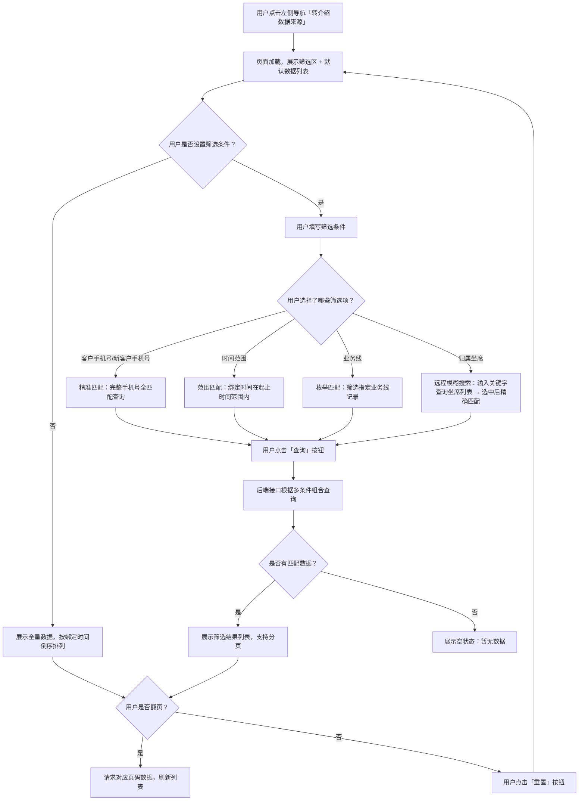

# 转介绍数据来源 PRD

## 一、修订记录

| 版本号 | 修改日期 | 修改原因 | 修订人 |
|--------|----------|----------|--------|
| v1.0 | 2026-03-24 | 初稿 | AI PRD Writer |
| v1.1 | 2026-03-24 | 删除来源筛选项；介绍人取值改为链接 followID；权限规则调整；手机号明文展示 | AI PRD Writer |
| v1.2 | 2026-03-24 | 新增：线索查询页「转介绍信息」绑定过期提示功能 | AI PRD Writer |

## 二、需求概述

### 背景/现状

当前 CRM 系统「客户管理 > 转介绍线索」（`/WH_CRM_v2/customer/referralClue/index`）页面主要用于管理转介绍产生的线索信息。但运营和管理人员缺少一个专门查看转介绍数据来源明细的入口，无法快速了解每一条转介绍记录的来源链接、绑定关系以及归属情况。这导致在分析转介绍活动效果、追踪来源渠道贡献时，需要通过多处数据拼接，效率低下。

### 需求目标

1. 在「客户管理 > 转介绍线索」同层级新增一个页面「转介绍数据来源」，路径为 `/WH_CRM_v2/customer/referralSource/index`。
2. 提供完整的转介绍数据来源明细列表，包含业务线、客户手机号、新客户手机号、绑定时间、归属坐席、介绍人、来源链接等关键字段。
3. 支持多维度筛选（手机号精准搜索、绑定时间范围、业务线、归属坐席模糊搜索），方便运营人员快速定位目标数据。

### 核心逻辑简述

新增「转介绍数据来源」页面作为「转介绍线索」的同层级菜单项。页面提供筛选区和数据列表两个核心区域。筛选区支持客户手机号/新客户手机号精准搜索、绑定时间范围选择（精确到秒）、业务线下拉枚举（电销/体验营）、归属坐席远程模糊搜索下拉选择。数据列表展示转介绍绑定关系明细，支持分页查看。后端根据筛选条件查询转介绍绑定记录并返回列表数据。

## 三、术语表

| 术语 | 定义 |
|------|------|
| 转介绍 | 老客户（介绍人）将新客户推荐给平台的行为，建立老客户与新客户之间的绑定关系 |
| 介绍人 | 发起转介绍行为的老客户，取值来源为来源链接 URL 中的 `followID` 参数，通过该 ID 关联到具体的坐席/用户信息 |
| followID | 来源链接 URL 中携带的参数，标识发起转介绍分享的人员 ID，用于确定介绍人身份 |
| 客户手机号 | 介绍人（老客户）在平台注册时使用的手机号码 |
| 新客户手机号 | 被介绍的新用户在平台注册时使用的手机号码 |
| 绑定时间 | 新客户通过转介绍链路完成与介绍人绑定关系建立的时间点 |
| 归属坐席 | 该条转介绍记录所归属的电销/体验营坐席人员 |
| 来源 | 新用户与老用户绑定入库时记录的来源链接 URL，包含 `followID` 等参数，用于追踪转介绍渠道入口和关联介绍人 |
| 业务线 | 该条转介绍记录所属的业务线，分为电销和体验营 |

## 四、调整范围

| 序号 | 功能模块 | 调整说明 |
|------|----------|----------|
| 1 | 左侧导航菜单 | 新增：在「客户管理 > 转介绍线索」同层级新增「转介绍数据来源」菜单项 |
| 2 | 转介绍数据来源页面 — 筛选区 | 新增：包含客户手机号/新客户手机号输入、绑定时间范围选择、业务线下拉、归属坐席模糊搜索下拉 |
| 3 | 转介绍数据来源页面 — 数据列表 | 新增：展示业务线、客户手机号、新客户手机号、绑定时间、归属坐席、介绍人、来源 7 个字段 |
| 4 | 转介绍数据来源页面 — 分页 | 新增：列表底部分页器，默认每页 20 条 |
| 5 | 线索查询页 — 转介绍信息区块 | 调整：当转介绍绑定关系已过期时，在「转介绍信息」标题后增加红色提示标签「转介绍绑定已过期」 |

## 五、业务流程图



## 六、可交互原型

在线预览：[点击查看可交互原型](https://yping-98.github.io/referral-data-source/%E8%BD%AC%E4%BB%8B%E7%BB%8D%E6%95%B0%E6%8D%AE%E6%9D%A5%E6%BA%90-%E4%BA%A4%E4%BA%92%E5%8E%9F%E5%9E%8B.html)

> 原型为可交互 HTML 页面，点击链接即可在浏览器中体验完整交互流程。

## 七、功能需求详细描述

### 7.1 页面整体布局

页面结构从左到右、从上到下依次为：

1. **左侧导航栏**：CRM 系统标准侧边栏，「转介绍数据来源」作为「客户管理」下的菜单项，与「转介绍线索」同层级
2. **顶部面包屑**：客户管理 > 转介绍数据来源
3. **筛选区**：包含多个筛选组件，横向排列自动换行
4. **数据列表区**：展示转介绍数据明细表格
5. **分页器**：列表底部分页控件

### 7.2 左侧导航菜单调整

| 功能按钮 | 功能说明 | 是否必填 | 功能类型 | 交互说明 | 备注 |
|----------|----------|----------|----------|----------|------|
| 转介绍数据来源 | 进入转介绍数据来源列表页 | — | 菜单项 | 点击后右侧内容区切换为转介绍数据来源页面；菜单项高亮 | 位于「客户管理」分组下，与「转介绍线索」同层级 |

### 7.3 筛选区

| 功能按钮 | 功能说明 | 是否必填 | 功能类型 | 交互说明 | 备注 |
|----------|----------|----------|----------|----------|------|
| 客户手机号 | 按介绍人手机号精准搜索 | 否 | 文本输入框 | 输入完整手机号后点击查询，后端进行精准匹配 | placeholder: "请输入客户手机号"；仅支持 11 位数字输入 |
| 新客户手机号 | 按被介绍新客户手机号精准搜索 | 否 | 文本输入框 | 输入完整手机号后点击查询，后端进行精准匹配 | placeholder: "请输入新客户手机号"；仅支持 11 位数字输入 |
| 绑定时间范围 | 根据绑定时间（新客户与老客户绑定入库的时间）筛选 | 否 | 日期时间范围选择器 | 选择开始时间和结束时间，精确到秒（YYYY-MM-DD HH:mm:ss）；结束时间不得早于开始时间 | 默认不选择，即查询全部时间段；选择后自动校验时间先后顺序；筛选条件为 `绑定时间 >= 开始时间 AND 绑定时间 <= 结束时间` |
| 业务线 | 按业务线筛选 | 否 | 下拉选择器 | 单选；枚举值：全部 / 电销 / 体验营 | 默认"全部" |
| 归属坐席 | 按归属坐席筛选 | 否 | 远程搜索下拉选择器 | 用户输入关键字（≥2 个字符）触发远程模糊查询，返回匹配的坐席列表供选择；选中后作为精确条件查询 | placeholder: "请输入坐席姓名搜索"；API: `/api/agent/search?keyword=xxx` |
| 查询 | 触发筛选查询 | — | 按钮（主按钮） | 点击后根据当前所有筛选条件组合查询，刷新数据列表，页码重置为第 1 页 | — |
| 重置 | 清空所有筛选条件 | — | 按钮（默认按钮） | 点击后清空所有筛选输入/选择项，恢复默认值，刷新数据列表 | — |

**筛选交互规则：**

- 所有筛选条件为 AND 关系，多条件组合查询
- 点击「查询」按钮才会触发请求，输入过程中不自动搜索（归属坐席的下拉候选列表除外）
- 点击「重置」按钮后，所有筛选项恢复到默认状态（输入框清空，下拉选择器回到"全部"），并自动触发一次查询刷新列表
- 时间范围选择器选择后：
  - 如果只选了开始时间未选结束时间，查询开始时间之后的所有记录
  - 如果只选了结束时间未选开始时间，查询结束时间之前的所有记录
  - 如果结束时间早于开始时间，前端 toast 提示"结束时间不能早于开始时间"，不发起请求

### 7.4 数据列表

| 字段名称 | 字段说明 | 字段来源 | 备注 |
|----------|----------|----------|------|
| 业务线 | 该条转介绍记录所属业务线 | 后端返回 | 枚举值：电销 / 体验营 |
| 客户手机号 | 介绍人（老客户）的手机号 | 后端返回 | 11 位手机号，明文展示，不脱敏 |
| 新客户手机号 | 被介绍的新用户手机号 | 后端返回 | 11 位手机号，明文展示，不脱敏 |
| 绑定时间 | 新客户与老客户完成绑定入库的时间 | 后端返回 | 格式：YYYY-MM-DD HH:mm:ss |
| 归属坐席 | 该记录归属的坐席人员姓名 | 后端返回 | 展示坐席姓名 |
| 介绍人 | 发起转介绍分享的人员 | 后端从来源链接中解析 `followID` 参数，再关联查询对应的人员姓名 | 取值逻辑：解析来源 URL 中的 `followID` 参数 → 根据 followID 查询对应人员姓名 → 展示姓名；如 followID 为空或无法匹配则展示"—" |
| 来源 | 新用户与老用户绑定入库时的来源链接 URL | 后端返回 | 展示为可点击的超链接，点击后在新标签页打开；链接文本截断展示（最多显示 40 个字符，超出部分用 `...` 省略）；鼠标 hover 时 tooltip 展示完整链接地址；链接中包含 `followID` 参数用于关联介绍人 |

**列表交互规则：**

- 默认按绑定时间倒序排列（最新的在最前面）
- 绑定时间列支持点击表头排序（升序/降序切换）
- 表格无数据时展示空状态占位图，文案"暂无数据"
- 表头固定，列表区域支持纵向滚动

### 7.5 线索查询页 — 转介绍绑定过期提示

#### 7.5.1 功能说明

在现有的「线索查询」页面（路径：`/WH_CRM_v2/customer/clueSearch`），当查询到某条线索存在转介绍信息时，系统根据转介绍绑定时间判断当前转介绍关系是否仍然有效。若绑定关系已过期，则在「转介绍信息」区块标题后面增加红色提示标签「转介绍绑定已过期」。

#### 7.5.2 过期判定逻辑

| 判定条件 | 说明 |
|----------|------|
| 数据前提 | 线索详情中存在转介绍信息（推荐人洋葱ID 不为空） |
| 判定依据 | 转介绍绑定时间（bindTime）与当前服务期时间范围 |
| 过期规则 | 当前时间已超出该线索所属服务期的结束时间，或转介绍绑定关系已被系统解除（后端字段 `referralStatus` 标识），则判定为已过期 |
| 未过期 | 当前时间仍在服务期内，且绑定关系有效 |

**判定逻辑（伪代码）：**

```
IF 转介绍信息存在:
    IF referralStatus == "EXPIRED" OR 当前时间 > 服务期结束时间:
        展示「转介绍绑定已过期」红色标签
    ELSE:
        不展示过期标签（正常状态）
ELSE:
    不展示转介绍信息区块
```

#### 7.5.3 UI 展示规则

| 元素 | 说明 |
|------|------|
| 位置 | 「转介绍信息」标题文字右侧，同行展示 |
| 样式 | 红色标签：背景色 #FFF2F0，文字色 #FF4D4F，边框色 #FFCCC7，圆角 4px |
| 文案 | "转介绍绑定已过期" |
| 展示条件 | 仅当转介绍信息存在且绑定关系已过期时展示 |
| 正常状态 | 不展示任何标签，「转介绍信息」标题保持原样 |

#### 7.5.4 接口调整

在现有的线索详情接口返回数据中，增加以下字段：

| 参数名 | 类型 | 说明 |
|--------|------|------|
| referralInfo.referralStatus | String | 转介绍绑定状态，枚举值：ACTIVE（有效）/ EXPIRED（已过期） |
| referralInfo.bindTime | String | 转介绍绑定时间 |
| referralInfo.serviceEndTime | String | 所属服务期结束时间 |

前端根据 `referralStatus` 字段直接判断是否展示过期标签，无需前端进行时间计算。

### 7.6 分页器（转介绍数据来源页面）

| 功能 | 说明 |
|------|------|
| 位置 | 列表底部右侧 |
| 默认每页条数 | 20 条 |
| 每页条数可选 | 10 / 20 / 50 / 100 |
| 展示内容 | 共 X 条数据，当前页/总页数，页码按钮 |
| 翻页 | 点击页码或上下页按钮，请求对应页码数据刷新列表 |
| 筛选后分页 | 筛选条件变化时，页码自动重置为第 1 页 |

### 7.7 接口设计要求

**列表查询接口：**

- 请求方式：POST
- 路径：`/api/referralSource/list`
- 请求参数：

| 参数名 | 类型 | 必填 | 说明 |
|--------|------|------|------|
| customerPhone | String | 否 | 客户手机号，精准匹配 |
| newCustomerPhone | String | 否 | 新客户手机号，精准匹配 |
| startTime | String | 否 | 开始时间，格式 YYYY-MM-DD HH:mm:ss |
| endTime | String | 否 | 结束时间，格式 YYYY-MM-DD HH:mm:ss |
| businessLine | String | 否 | 业务线，枚举：TELEMARKETING / EXPERIENCE_CAMP |
| agentId | Long | 否 | 归属坐席 ID |
| pageNum | Integer | 是 | 当前页码，从 1 开始 |
| pageSize | Integer | 是 | 每页条数 |

- 返回参数：

| 参数名 | 类型 | 说明 |
|--------|------|------|
| total | Long | 总条数 |
| list | Array | 数据列表 |
| list[].businessLine | String | 业务线 |
| list[].customerPhone | String | 客户手机号（完整） |
| list[].newCustomerPhone | String | 新客户手机号（完整） |
| list[].bindTime | String | 绑定时间 |
| list[].agentName | String | 归属坐席姓名 |
| list[].referrerName | String | 介绍人姓名，从来源链接的 followID 参数关联查询获取 |
| list[].followId | String | 来源链接中的 followID 参数值 |
| list[].sourceUrl | String | 来源链接 URL（新用户与老用户绑定入库的链接） |

**坐席模糊搜索接口：**

- 请求方式：GET
- 路径：`/api/agent/search`
- 请求参数：

| 参数名 | 类型 | 必填 | 说明 |
|--------|------|------|------|
| keyword | String | 是 | 搜索关键字，≥2 个字符 |

- 返回参数：

| 参数名 | 类型 | 说明 |
|--------|------|------|
| list | Array | 坐席列表 |
| list[].agentId | Long | 坐席 ID |
| list[].agentName | String | 坐席姓名 |

## 八、埋点与数据需求

| 事件名称 | 触发时机 | 关键参数 | 用途 |
|----------|----------|----------|------|
| referral_source_page_view | 用户进入转介绍数据来源页面 | userId | 统计页面访问量和活跃用户 |
| referral_source_search | 用户点击「查询」按钮 | filterParams（包含所有筛选条件）、resultCount（查询结果条数） | 分析筛选使用习惯和数据匹配率 |
| referral_source_reset | 用户点击「重置」按钮 | userId | 分析重置频率，判断筛选项是否合理 |
| referral_source_page_change | 用户切换分页 | pageNum、pageSize | 分析用户浏览深度 |

## 九、权限说明

数据权限根据当前登录用户与记录中的「归属坐席」或「介绍人」字段进行匹配判断，**满足任意一个条件即可查看该条记录**。

| 角色 | 权限规则 | 说明 |
|------|----------|------|
| 普通坐席 | 归属坐席 = 自己 **或** 介绍人 = 自己 | 只要记录中的归属坐席或介绍人任一为当前坐席本人，即可查看 |
| 主管（小组长） | 归属坐席 ∈ 组内成员 **或** 介绍人 ∈ 组内成员 | 只要记录中的归属坐席或介绍人任一为本组成员，即可查看 |
| 团长 | 归属坐席 ∈ 团内成员 **或** 介绍人 ∈ 团内成员 | 只要记录中的归属坐席或介绍人任一为本团成员，即可查看 |
| 管理员 | 查看全部数据 | 不受归属坐席和介绍人限制，可查看所有转介绍数据来源记录 |

**权限判定逻辑（伪代码）：**

```
IF 当前用户角色 == 管理员:
    返回全部数据
ELSE:
    获取当前用户的可见人员范围 memberIds（坐席=自己, 主管=组内, 团长=团内）
    筛选条件: 归属坐席ID ∈ memberIds OR 介绍人followID ∈ memberIds
```

> **备注**：权限控制在后端接口层面实现。前端请求时自动附带当前用户身份信息，后端根据用户角色计算可见人员范围，对数据进行过滤后返回。归属坐席筛选项中仅展示当前用户权限范围内的坐席列表。
